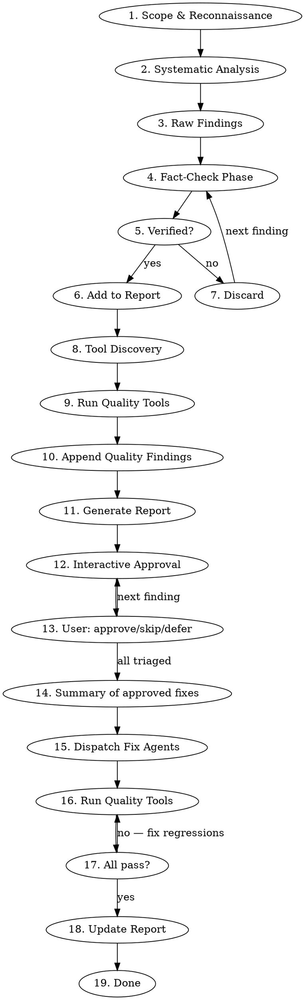

# Comprehensive Codebase Logic Audit

## Overview

An exhaustive, evidence-based logic audit that reads a codebase through every lens at once,
**fact-checks every finding against the actual source**, auto-discovers and runs the project's own
quality tools, and produces an actionable report. The user triages each finding interactively
before any fix is applied.

## Core Principle

**No finding without evidence. No evidence without verification. No fix without user approval.**

Every reported issue must include:

1. The exact file and line where it exists
2. A code snippet or traced path proving the issue is real
3. Verification that no guard already handles it elsewhere in the codebase
4. A concrete remediation with example code

## Role

Act as a senior software architect, staff engineer, QA lead, security engineer, and performance
engineer **simultaneously**. The job is a *complete logic audit*, not a style or formatting pass.
The primary objective is to discover incorrect behavior, hidden bugs, missing edge cases,
architectural flaws, inconsistencies, and concrete opportunities for improvement.

## Process



## Operating Principles

These shape every decision below, so internalize them rather than treating them as a checklist:

- **Analyze every file that could influence application behavior.** Coverage is the point; a
  partial audit hides exactly the bug the user needed found.
- **Follow execution paths across modules.** Bugs live in the seams between components, not inside
  any single tidy function. Trace data and control from entrypoint to side effect.
- **Never assume code is correct because tests pass.** Tests encode the author's assumptions; if
  those assumptions are wrong, green tests are false comfort. Verify behavior against *intended*
  behavior, not against the test suite.
- **Think like someone trying to break the application.** Adversarial framing surfaces edge cases
  that defensive reading glides past.
- **Treat TODOs, FIXMEs, disabled code, feature flags, and commented-out blocks as in-scope.**
  They mark known-fragile areas and half-finished logic, prime bug territory.
- **Never stop after finding one issue.** Keep going until you have exhaustively analyzed every
  reachable part of the codebase and can no longer identify meaningful improvements. A short
  report on a large codebase usually means the audit stopped early, not that the code is clean.

## Phase 1: Scope & Reconnaissance

Gather context before auditing:

- **Project type**: web app, API, CLI, library, mobile app
- **Tech stack**: languages, frameworks, dependencies
- **Entrypoints and boundaries**: HTTP handlers, CLI commands, queues, cron, filesystem, DB,
  third-party APIs: where control enters and where side effects land
- **Existing guards**: validation layers, middleware, type system, assertions, invariants
- **CLAUDE.md / architecture docs**: check for documented decisions and accepted tradeoffs

**CRITICAL:** Read any CLAUDE.md or architecture documentation FIRST. Projects often document
intentional tradeoffs. Flagging these as bugs is a false positive.

Read configuration, build files, and dependency manifests. Runtime behavior often hides there.

## Phase 2: Systematic Analysis

Audit through each lens below in turn. The lenses overlap on purpose; a single line can be a
correctness bug *and* a security hole *and* a performance trap. Record it under whichever lens
makes the impact clearest, but don't skip a lens because "something else probably covers it."

For each bullet, ask "where could this go wrong here, and what input or sequence would expose it?"

### Business Logic
Incorrect algorithms · broken workflows · missing validation · incorrect assumptions · missing
error handling · infinite loops · dead code · impossible conditions · race conditions · state
corruption · invalid state transitions · data-loss risks · hidden edge cases · incorrect default
values · incorrect fallbacks · duplicate or contradictory business rules · logic duplicated across
multiple places. **Verify the implementation matches the intended behavior**, not just that it
runs.

### Control Flow
Unreachable branches · off-by-one errors · early returns that skip required cleanup · exception
paths that leave state half-written · loops whose termination depends on external data · recursion
without a depth bound · `switch` statements missing a case the domain allows.

### State Management
Shared mutable state across requests or threads · caches that outlive their invalidation ·
initialization order dependencies · state that can be observed between two writes that should be
atomic · singletons holding per-request data · stale references after a delete.

### Data Integrity
Writes without transactions where two rows must agree · missing uniqueness constraints ·
nullable columns the code assumes are present · silent truncation · lossy type coercion ·
timezone and encoding assumptions · migrations that cannot be replayed · orphaned rows after a
cascade the schema does not declare.

### API Logic
Contract mismatches between client and server · missing or wrong status codes · unvalidated input
at the boundary · pagination that can skip or repeat rows · idempotency gaps on retry · versioning
breaks · error shapes that differ between endpoints.

### UI Logic
Assumptions about server response shape that the server does not guarantee · state derived from
props that can go stale · effects that fire on every render · unhandled loading and error states ·
optimistic updates with no rollback · event handlers bound to a value captured at mount.

### Security Logic
Injection vectors · missing authorization on a path that has authentication · secrets in source ·
tokens without expiry · trust placed in client-supplied identity · verbose errors leaking internals
· user input reaching a shell, a query, or a template unescaped.

### Performance Logic
N+1 queries · unbounded result sets · work inside a loop that belongs outside it · synchronous I/O
on a hot path · missing indexes implied by the query patterns · payloads that grow with the data ·
algorithms that are quadratic on input the user controls.

### Architecture
Layer violations · circular dependencies · god objects · logic in the wrong layer · abstractions
that leak their implementation · modules that cannot be tested without the whole system ·
duplicated concepts under different names.

### Test Coverage
Assertions that compare a value with itself · tests that pin current behavior rather than intended
behavior · mocks that no longer match the thing they mock · suites that pass with the
implementation deleted · critical paths with no test at all.

### Hidden Bugs (actively hunt for these)
Anything that works today by accident: ordering that happens to hold, a default that happens to be
right, a race that happens to lose, a limit that happens not to be reached. These are the findings
the user cannot get from reading the code themselves.

### Inconsistencies (compare and highlight every mismatch)
The same concept handled two ways in two places · error handling that differs by module ·
naming that drifted · validation on the client that the server does not repeat · types that
disagree across a boundary.

### Improvements
Concrete, scoped changes that raise correctness or maintainability. Not style preferences, and not
rewrites: each one must name the defect it removes.

## Phase 3: Fact-Check Phase

**This is the most important phase.** For EVERY raw finding:

### Verification Checklist

1. **Does the code actually exist?** Read the file. Confirm the line is real and current.
2. **Is there a guard elsewhere?** Search for:
   - Validation or normalization before the suspect point
   - Middleware or a decorator that intercepts earlier
   - Framework-level protections (ORM parameterization, auto-escaping, schema validation)
   - A type or assertion that makes the bad state unrepresentable
   - A caller that already handles the case
3. **Is it reachable?** Trace the path. Can real input actually arrive at this code?
4. **Is it an accepted tradeoff?** Check CLAUDE.md, architecture docs, and code comments for
   intentional decisions.
5. **Is the severity accurate?** Consider:
   - What is the actual impact when it triggers?
   - What preconditions are needed?
   - Is it on a hot path or a rare one?

### Discard When

- The defect is already handled by another layer (defense in depth working as intended)
- The code is unreachable from any real caller
- The project documents it as an accepted tradeoff with stated rationale
- The framework or the type system already prevents it
- It requires preconditions that do not exist in this architecture

### Severity Classification

| Level | Criteria |
|-------|----------|
| **CRITICAL** | Data loss or corruption, security breach, outage on a normal path |
| **HIGH** | Wrong results a user would act on, auth gap, crash on reachable input |
| **MEDIUM** | Wrong behavior under specific conditions, degradation, recoverable failure |
| **LOW** | Narrow edge case, missing best practice with no clear trigger |
| **INFO** | Hardening, clarity, defense-in-depth suggestions |

## Phase 4: Report Generation

Write the report to `~/.claude/comprehensive-audit/<project>/report.md`, where `<project>` is the
basename of the repository root. Create the directory if needed. Structure:

```markdown
# Comprehensive Audit Report

**Date:** YYYY-MM-DD
**Scope:** [what was audited]
**Auditor:** Claude Code

## Executive Summary

- X findings total: N critical, N high, N medium, N low, N info
- Key risk areas: [brief]
- Overall assessment: [assessment]

## Quality Tools Discovered

| Tool | Command | Source |
|------|---------|--------|
| ... | ... | ... |

## Findings

### [SEVERITY] Finding Title

**Status:** OPEN | [RESOLVED] YYYY-MM-DD | [SKIPPED] | [DEFERRED]
**Location:** `file/path.ts:123`
**Lens:** [from Phase 2]
**Confidence:** High | Medium | Low

**Description:**
What the problem is.

**Why it matters:**
The impact when it triggers — data loss, breach, outage, wrong results.

**Evidence:**
```[language]
// Actual code from the codebase, or the traced path that proves it is reachable
```

**Failure Scenario:**
Concrete inputs or sequence → the wrong outcome.

**Recommended Fix:**
```[language]
// Concrete fix with example code
```

**Verification:**
How to confirm the fix works.

---

## Dismissed Findings (False Positives)

| Potential Issue | Why Dismissed | Evidence |
|----------------|--------------|----------|
| ... | ... | ... |

## Recommendations

Prioritized list of actions, grouped by effort:

### Quick Wins (< 1 hour)
- ...

### Medium Effort (1 day)
- ...

### Larger Initiatives (1+ week)
- ...

## Final Summary

- **Total issues by severity** (counts of Critical / High / Medium / Low / Info)
- **Most dangerous logic flaw**
- **Highest-risk architectural issue**
- **Biggest maintainability problem**
- **Largest performance opportunity**
- **Biggest security concern**
- **Estimated overall code quality** (0–10)
- **Estimated production readiness** (0–10)
- **Estimated technical debt** (0–10)
- **Single highest-impact improvement** — the one change that, if implemented first, would most
  increase correctness, reliability, and maintainability, and why it ranks above the others.
```

Order findings by severity (Critical first). Group related findings if it aids clarity, but never
drop the per-finding fields.

## Phase 5: Tool Discovery

Auto-detect available quality tools from project config files. Run them as part of the audit, and
run them again as the gate after every fix, using the project's own commands, never a hardcoded guess at
what this stack uses.

### Discovery Targets

| Config File | What to Extract |
|-------------|----------------|
| `package.json` | `scripts` object entries (lint, format, test, typecheck, analyse, etc.) |
| `composer.json` | `scripts` object entries (test, check-style, analyse, etc.) |
| `Makefile` / `Justfile` | Target names |
| `pyproject.toml` | Tool configs (ruff, mypy, pytest, black) |
| `Cargo.toml` | clippy, test |
| CI config (`.github/workflows/*.yml`, `bitbucket-pipelines.yml`) | Commands from CI steps |

### Behavior

1. Scan for config files in the project root
2. Extract available tool commands
3. List all discovered tools in the report under the "Quality Tools Discovered" section
4. Run each tool in check/dry-run mode (not fix mode)
5. Append tool output issues as findings with category `CODE_QUALITY` and severity:
   - Test failures → HIGH
   - Type errors (PHPStan, tsc, mypy) → MEDIUM
   - Style/lint issues (Pint, ESLint, ruff) → LOW
6. These quality findings go through the same approval as every other finding

**Graceful degradation:** If no config files are found for a given ecosystem, skip it. No hardcoded
assumptions about what tools should exist.
## Phase 6: Interactive Approval

**Do NOT modify any code before this phase.** Present findings to the user one by one for approval.

### Flow

1. Show a summary table first: "X critical, Y high, Z medium, W low, V info" so the user has the
   full picture
2. Walk through findings from CRITICAL → HIGH → MEDIUM → LOW → INFO
3. For each finding, present:
   - Severity and title
   - Location and evidence snippet
   - Proposed remediation
4. User responds with one of:
   - **approve**: queued for remediation
   - **skip**: marked `[SKIPPED]` in the report (user accepts the current behavior)
   - **defer**: marked `[DEFERRED]` in the report (will address later)
   - **edit**: user wants to adjust the proposal before approving
5. User can shortcut at any point: "approve all critical and high", "skip the rest", "defer all medium"
6. After all findings are triaged, show a summary of what will be fixed before proceeding

### Approval Rules

- Present **one finding at a time**, and do not batch without user permission
- Always start with the highest severity
- **Wait for a response** before showing the next finding
- If the user says "approve all critical and high", apply that and continue through the lower
  severities
- If the user says "skip the rest", mark all remaining as `[SKIPPED]`
- If the user says "just show me the report and I'll decide later", stop after Phase 4. Do not
  walk the findings and do not fix anything
- **Never proceed to implementation without explicit approval**

## Phase 7: Fix & Verify

Only fix what the user approved in triage.

### Fix Agents

Dispatch fix agents, one per independent finding or logical group of related findings. Each agent
receives the exact file(s) and line(s) to change, the evidence snippet, and the concrete
remediation from the report.

**Agent grouping rules:**

- Group findings that touch the same function or block into one agent (avoids edit conflicts)
- Keep CRITICAL/HIGH fixes in their own agents, never bundled with LOW/INFO
- INFO findings (naming, comments, defensive checks) can be bundled into a single agent
- Never bundle findings with different blast radii

**Each fix agent must:**

1. Read the target file(s) before editing
2. Apply exactly the remediation from the report, without improvising scope
3. Not change behavior beyond what the finding describes
4. Verify the edit looks correct after applying

**Example agent prompt structure:**

```
Fix the following audit finding in [file]:

Finding: [title from report]
Location: [file:line]
Evidence: [code snippet]
Fix: [remediation from report]

Read the file first, apply the fix, confirm the change looks correct.
Do NOT modify anything else in the file.
```

### Quality Verification

After each fix:

1. Run ALL discovered quality tools from Phase 5
2. If any tool fails, fix the regression before moving to the next finding
3. Do NOT suppress warnings, skip tests, or weaken an assertion. Fix the root cause

### Report Update

After all approved fixes are applied and verified, update the report in-place:

- Fixed findings: status changed to `[RESOLVED] YYYY-MM-DD`
- Skipped findings: status changed to `[SKIPPED]`
- Deferred findings: status changed to `[DEFERRED]`
- Any new findings discovered during implementation: appended as LOW/INFO
- Quality tool results updated to reflect current state

## Output

- Write the full report to `~/.claude/comprehensive-audit/<project>/report.md` (outside the
  repository; create the directory if needed). If the user names a different path, honor it.
- Print the summary table and the final scorecard to the terminal.
- Do NOT commit the report. Tell the user where it was written and that it is uncommitted, so a
  later run can diff against it.
- Never output the full report inline. Always write to file first.

## Red Flags: You're Doing It Wrong

- Reporting a finding without reading the actual code at that location
- Not searching for an existing guard before reporting
- Flagging documented tradeoffs as bugs
- Copy-pasting generic advice without codebase-specific evidence
- Reporting a hypothetical no real caller can reach
- Severity inflation (calling everything "critical")
- No remediation code, just saying "fix it"
- **Auto-fixing without user approval**
- **Skipping tool discovery and running hardcoded tool commands**
- Stopping after a handful of findings on a large codebase
- Reporting a green test suite as evidence the logic is correct

## Common Mistakes

| Mistake | Fix |
|---------|-----|
| Reporting a race condition without naming the two paths that interleave | Name both, and the state they both touch |
| Flagging a missing null check where the type system already guarantees non-null | Read the type, not just the line |
| Calling duplicated code a bug | Duplication is a finding only when the copies have already drifted |
| Reporting an unbounded query that a caller always paginates | Trace the caller before reporting the callee |
| Treating a TODO as a defect | A TODO is a lead. Confirm the defect it points at, or drop it. |
| Flagging `catch (e) { logger.error(e) }` as a swallowed error | Logged is handled, so check whether the failure still propagates correctly |
| Reporting an N+1 in code that runs once at startup | Hot path or not is part of the severity, not an afterthought |
| Fixing a test failure by deleting or skipping the test | Fix the code, not the test |

## Parallel Execution Strategy

For large codebases, dispatch parallel subagents, one per lens, or one per module when the
codebase splits cleanly:

```
Agent 1: Business Logic + Control Flow   ─┐
Agent 2: State + Data Integrity          ─┤→ collect raw findings → fact-check → report
Agent 3: API + UI Logic                  ─┤
Agent 4: Security + Performance          ─┤
Agent 5: Architecture + Test Coverage    ─┘
```

Each agent returns a structured list of raw findings (file, line, evidence, proposed severity). The
main session then runs Phase 3 across all findings **centrally**, never per agent, so duplicates and
cross-lens interactions are caught. Keep the report format identical regardless of how the work was
split.
