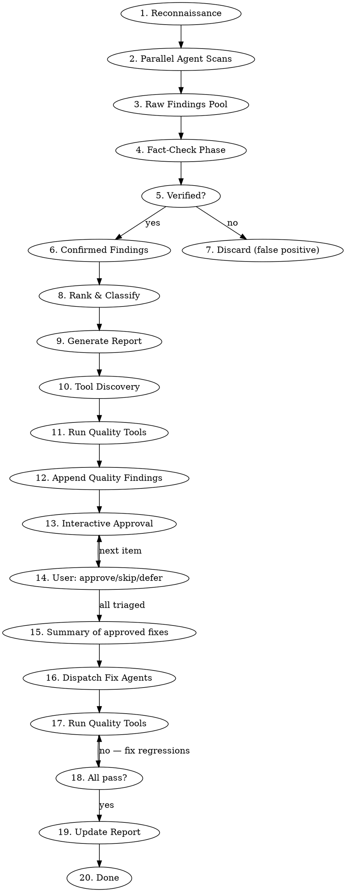

# Decompose: Structural Health Scan

## Overview

A multi-agent codebase scan that identifies structural rot (god classes, monolithic modules, fragile logic, and anti-patterns), then **fact-checks every finding against the actual source**, eliminates false positives, and produces a ranked decomposition plan the user approves item-by-item before any code is touched.

## Core Principle

**No finding without evidence. No evidence without verification. No fix without user approval.**

Every finding must include:
1. The exact file, class, or function that exhibits the problem
2. Quantitative evidence (line count, responsibility count, coupling count, test failure output)
3. Verification that the finding is real and not an artifact of generated code or intentional design
4. A concrete decomposition or fix proposal with named target components

## Process



## Phase 1: Reconnaissance

Before dispatching scan agents, establish ground truth:

- **Stack & language**: infer from file extensions, `package.json`, `tsconfig.json`, build configs
- **Module boundaries**: directory structure, barrel exports, monorepo package layout
- **Existing design docs**: `CLAUDE.md`, `README`, `/docs`. Look for intentional architecture decisions. An intentional god class documented as a façade is not a finding.
- **Test surface**: what test files exist, what runs, what fails. Run the test suite and capture failures before scanning.
- **Most-changed files**: `git log --format= --name-only | sort | uniq -c | sort -rn | head -30`. Hot files are high-leverage targets.
- **Size outliers**: find files over 300 lines with `find . -name "*.ts" -o -name "*.js" | xargs wc -l | sort -rn | head -30` (adapt for language). Long files are candidates, not confirmed findings.

**Read CLAUDE.md and any architecture docs FIRST.** Do not flag intentional façades, intentional aggregation points, or documented design decisions as god classes.

## Phase 2: Parallel Agent Scans

Dispatch parallel subagents, one per category. Each returns raw findings with evidence. Never wait for one to finish before starting another. Dispatch all simultaneously.

### Agent 1: God Class Scanner

**Goal:** Find classes and modules that violate the Single Responsibility Principle by doing too many distinct things.

**Heuristics (flag if ≥2 apply):**
- Class/module > 300 lines of substantive code (excluding comments and blanks)
- > 10 public methods with no clear unifying responsibility
- Methods cover ≥3 distinct domains (e.g., persistence + business logic + HTTP response formatting)
- > 7 constructor/top-level dependencies injected
- The class name is vague: `Manager`, `Service`, `Helper`, `Utils`, `Handler` with no qualifier
- Other classes import this one for fundamentally different reasons (check importers)

**How to search:**
```
# Find large files
find . -name "*.ts" -o -name "*.js" -o -name "*.py" | xargs wc -l | sort -rn | head -40

# Count methods per class (TypeScript/JS)
grep -n "^\s*\(public\|private\|protected\|async\)\s" <file> | wc -l

# Find classes with "Manager", "Service", "Utils", "Helper" in name
grep -rn "class.*\(Manager\|Service\|Helper\|Utils\|Handler\)" src/

# Count importers — a class imported by many different domains is a candidate
grep -rl "from.*<target-module>" src/ | wc -l
```

**For each candidate:** list the top-level methods grouped by responsibility. If methods naturally split into ≥2 named groups with no shared state, it's a confirmed god class.

**Output per finding:**
- File and class name
- Line count
- List of responsibilities with example method names per group
- Proposed decomposition: named target classes/modules with what moves where

---

### Agent 2: Bloated Function / Spaghetti Logic Scanner

**Goal:** Find functions and methods that are too long, too deeply nested, or do too many things to be reliably maintained or tested.

**Heuristics (flag if ≥1 applies):**
- Function > 80 lines
- Cyclomatic complexity proxy: > 5 levels of nesting (count indent levels)
- Function does I/O AND computation AND side effects with no separation
- Multiple `return` paths with different shapes (returns `string` in one branch, `object` in another)
- Boolean flag parameters that change core behavior (`doSomething(x, true, false, true)`)
- Copy-paste duplication: near-identical logic blocks within the same file

**How to search:**
```
# Find long functions — look for function declarations and count lines until next function
# Read the files, don't just grep line counts

# Find deeply nested code (4+ levels)
grep -n "        " <file> — excessive indentation is a smell

# Find boolean-flag parameters
grep -rn "function.*bool\|: boolean)" src/ — then check callers

# Find TODO/FIXME/HACK markers — devs signal pain points themselves
grep -rn "TODO\|FIXME\|HACK\|XXX\|KLUDGE" src/
```

**For each candidate:** copy the function signature + first/last 10 lines as evidence. Propose a specific decomposition or simplification.

---

### Agent 3: Failing Logic Scanner

**Goal:** Find code that is broken, will break under realistic input, or fails silently.

**What to look for:**

| Pattern | Why It Fails |
|---------|--------------|
| Unhandled promise rejections | `.then()` without `.catch()`, `async` without try/catch at boundary |
| Swallowed errors | `catch (e) {}` or `catch (e) { return null }`, which hides failures |
| Type coercion bugs | `== null` vs `=== null`, `+undefined`, falsy-check on 0 or "" |
| Off-by-one in loops | `<` vs `<=`, array length -1 missing or extra |
| Missing null/undefined guards | Accessing `.property` on a value that can be `undefined` |
| Race conditions | Parallel state mutations without coordination |
| Infinite loop risk | `while (condition)` where condition is never mutated |
| Regex with ReDoS potential | Nested quantifiers like `(a+)+` |
| Dead code branches | `if (false)`, `if (x === undefined && x !== undefined)` |
| Mutations of function arguments | Modifying object parameters (unexpected side effects for callers) |

**Also:** Capture all **current test failures** from the test run in Phase 1. Each failing test is a confirmed finding with built-in evidence.

**How to search:**
```
# Swallowed errors
grep -rn "catch.*{}" src/
grep -rn "catch.*return null\|catch.*return undefined" src/

# Unguarded access patterns
grep -rn "\.[a-zA-Z]\+\.[a-zA-Z]\+" src/ — then read context

# Bare .then() without .catch()
grep -rn "\.then(" src/ | grep -v "\.catch\|await"

# TODO/FIXME with "broken", "wrong", "bug", "crash"
grep -rni "TODO.*broken\|FIXME.*crash\|HACK.*wrong" src/
```

---

### Agent 4: Coupling & Dependency Smell Scanner

**Goal:** Find architectural coupling that will make decomposition painful and that flags design problems.

**What to look for:**

| Smell | Description |
|-------|-------------|
| **Circular imports** | A imports B which imports A, which prevents tree-shaking and causes init bugs |
| **Layer violations** | UI code importing DB models directly; infra code importing domain logic |
| **Feature envy** | Function mostly calls methods on another object (should live there instead) |
| **Shotgun surgery** | Changing one concept requires touching 7+ files |
| **Inappropriate intimacy** | Class A accesses private internals of Class B via casting or `any` |
| **God module imports** | One file imported by > 20% of the codebase, a single point of breakage |
| **Ambient globals** | `window.X =`, `global.X =`, module-level mutable state not injected |

**How to search:**
```
# Find files imported by many others
for f in $(find src -name "*.ts"); do
  count=$(grep -rl "from.*$(basename $f .ts)" src/ | wc -l)
  echo "$count $f"
done | sort -rn | head -20

# Detect circular imports (if madge is available)
npx madge --circular src/ 2>/dev/null

# Layer violations: UI importing DB
grep -rn "from.*prisma\|from.*repository\|from.*db" src/components/ 2>/dev/null

# Ambient globals
grep -rn "global\.\|window\." src/ | grep "="
```

---

## Phase 3: Fact-Check Phase

**This is the most important phase. Never skip it.**

For every raw finding from all four agents:

### Verification Checklist

1. **Does the code actually exist as described?** Read the specific file and lines. Confirm the pattern is real.
2. **Is it intentional?** Check CLAUDE.md, inline comments, architecture docs. An intentional aggregation point is not a bug.
3. **Is it actually reachable?** Dead code isn't a god class but a deletion candidate.
4. **Does the "god class" actually have mixed responsibilities?** Re-read the methods. Sometimes a large class has a single deep responsibility: a codec, a parser, a state machine.
5. **Is the failing logic actually triggered?** Trace the call path. An unreachable bad branch is INFO, not HIGH.
6. **Is the coupling actually harmful?** A shared `utils/strings.ts` imported everywhere is fine. A `userAuthDatabaseApiStateManager.ts` imported everywhere is not.
7. **Is the test failure pre-existing or new?** Check `git log` on the failing test file.

### Discard When

- The file is generated code (check for `@generated`, `DO NOT EDIT`, build output paths)
- The "god class" is a documented façade or intentional aggregation point
- The "failing logic" is guarded by a condition that prevents it from ever running
- The coupling is between two things that should be coupled (same domain, same layer)
- The finding duplicates another finding at a higher severity (keep the higher one, drop the lower)

### Severity Classification

| Level | Criteria |
|-------|----------|
| **CRITICAL** | Active test failures; broken code on hot paths; unhandled exceptions in prod flows |
| **HIGH** | God class with ≥3 distinct responsibilities and > 400 lines; circular imports causing init failures; swallowed errors in critical paths |
| **MEDIUM** | God class with 2 responsibilities; long functions with extractable chunks; non-critical coupling smells |
| **LOW** | Style-level structural issues; naming that implies god-class but behavior is OK; minor duplications |
| **INFO** | Candidates worth watching; technical debt with no current impact |

---

## Phase 4: Report Generation

Write the report to `~/.claude/decompose/<project>/plan.md`, where `<project>` is the basename of
the repository root. Create the directory if needed.

```markdown
# Decompose Plan

**Date:** YYYY-MM-DD
**Scope:** [what was scanned]
**Test suite status at scan time:** [pass/fail — N failures]

## Executive Summary

- X findings total: N critical, N high, N medium, N low, N info
- Largest structural risks: [brief]
- Test failures discovered: [count]

## Quality Tools Discovered

| Tool | Command | Source |
|------|---------|--------|
| ... | ... | ... |

## Findings

### [SEVERITY] Finding Title

**Status:** OPEN | [RESOLVED] YYYY-MM-DD | [SKIPPED] | [DEFERRED]
**Location:** `src/path/to/File.ts` (class `TargetClass`)
**Category:** God Class | Bloated Function | Failing Logic | Coupling Smell
**Confidence:** High | Medium | Low
**Evidence:**
- Line count: N lines
- Responsibilities identified: [list]
- [Code snippet showing the problem — 5–15 lines max]

**Decomposition Proposal:**
- Extract `[NewClassName]` to `src/path/NewFile.ts` — takes [method list]
- Extract `[AnotherClass]` to `src/path/AnotherFile.ts` — takes [method list]
- [What stays in the original class after decomposition]

**Why this matters:**
[One sentence on the real risk — test brittleness, onboarding confusion, change-amplification, active failures]

---

## Dismissed Findings (False Positives)

| Candidate | Why Dismissed | Evidence |
|-----------|--------------|---------|
| `src/core/AppContext.ts` | Intentional facade documented in CLAUDE.md | CLAUDE.md:32 |
| ... | ... | ... |

## Recommendations

Prioritized list of actions, grouped by effort:

### Quick Wins (< 1 hour)
- ...

### Medium Effort (1 day)
- ...

### Larger Initiatives (1+ week)
- ...

## Summary Table

| # | Severity | Location | Category | Status |
|---|----------|----------|----------|--------|
| 1 | CRITICAL | `src/...` | Failing Logic | OPEN |
| 2 | HIGH | `src/...` | God Class | OPEN |
| ... | ... | ... | ... | ... |
```

---

## Phase 5: Tool Discovery

Auto-detect available quality tools from project config files. Run them as part of the audit, and
run them again as the gate after every fix, using the project's own commands, never a hardcoded guess at
what this stack uses.

### Discovery Targets

| Config File | What to Extract |
|-------------|----------------|
| `package.json` | `scripts` object entries (lint, format, test, typecheck, analyse, etc.) |
| `composer.json` | `scripts` object entries (test, check-style, analyse, etc.) |
| `Makefile` / `Justfile` | Target names |
| `pyproject.toml` | Tool configs (ruff, mypy, pytest, black) |
| `Cargo.toml` | clippy, test |
| CI config (`.github/workflows/*.yml`, `bitbucket-pipelines.yml`) | Commands from CI steps |

### Behavior

1. Scan for config files in the project root
2. Extract available tool commands
3. List all discovered tools in the report under the "Quality Tools Discovered" section
4. Run each tool in check/dry-run mode (not fix mode)
5. Append tool output issues as findings with category `CODE_QUALITY` and severity:
   - Test failures → HIGH
   - Type errors (PHPStan, tsc, mypy) → MEDIUM
   - Style/lint issues (Pint, ESLint, ruff) → LOW
6. These quality findings go through the same approval as every other finding

**Graceful degradation:** If no config files are found for a given ecosystem, skip it. No hardcoded
assumptions about what tools should exist.
## Phase 6: Interactive Approval

**Do NOT modify any code before this phase.** Present findings to the user one by one for
approval, starting from the highest severity.

### Flow

1. Show the summary table first, total count by severity, so the user has full context
2. Walk through findings from CRITICAL → HIGH → MEDIUM → LOW → INFO
3. For each finding, show:
   - Severity, location, category
   - The evidence snippet
   - The proposed decomposition
4. User responds with one of:
   - **approve**: queued for implementation
   - **skip**: marked `[SKIPPED]` (user accepts current design)
   - **defer**: marked `[DEFERRED]` (will address later)
   - **edit**: user wants to adjust the proposal before approving
5. Shortcuts: "approve all critical", "skip info", "defer all medium", etc.
6. After all items triaged, show a final list of what will be implemented before proceeding.

### Approval Rules

- Present **one finding at a time**, and do not batch without user permission
- Always start with the highest severity
- **Wait for a response** before showing the next finding
- If the user says "approve all critical and high", apply that and continue through the lower
  severities
- If the user says "skip the rest", mark all remaining as `[SKIPPED]`
- If the user says "just show me the report and I'll decide later", stop after Phase 4. Do not
  walk the findings and do not fix anything
- **Never proceed to implementation without explicit approval**

## Phase 7: Fix & Verify

### Dispatch Fix Agents

Only implement what the user approved. For each approved finding, dispatch a focused agent.

#### Agent Grouping Rules

- One agent per god-class decomposition (these are large and touch many files)
- One agent per test-failure fix (keep these isolated: one failure, one agent)
- Bundle LOW/INFO coupling fixes into one agent per directory
- Never bundle a CRITICAL with a MEDIUM, since the blast radii differ

#### Agent Prompt Template

```
Decompose the following structural finding in [file]:

Finding: [title from the plan]
Location: [file:line]
Category: [God Class / Bloated Function / Failing Logic / Coupling Smell]

Evidence:
[snippet from report]

Proposed change:
[decomposition proposal from report]

Instructions:
1. Read all affected files before making changes
2. Implement exactly the decomposition described — do not improvise scope
3. Update all import sites for moved symbols
4. Do NOT change behavior — only structure
5. Verify the code compiles and tests pass after your changes
```

#### Behavior Constraints

- **Do not change observable behavior** during decomposition. Extract, don't rewrite.
- **Update all import sites.** A class rename with one import left behind is a broken build.
- **No new abstractions.** The task is decomposition, not redesign.
- **Run the quality tools** after each agent completes, before dispatching the next.

### Quality Verification

After each fix:

1. Run ALL discovered quality tools from Phase 5
2. If any tool fails, fix the regression before moving to the next finding
3. Do NOT suppress warnings, skip tests, or weaken an assertion. Fix the root cause

A decomposition that breaks a gate is not a decomposition; it is a rewrite that got away. Extract,
run the gates, then extract again.

### Report Update

After all approved changes are applied and verified, update the report in-place:

- Fixed findings: status changed to `[RESOLVED] YYYY-MM-DD`
- Skipped findings: status changed to `[SKIPPED]`
- Deferred findings: status changed to `[DEFERRED]`
- Any new findings discovered during implementation: appended as LOW/INFO
- Quality tool results updated to reflect current state

## Output

- Write the full plan to `~/.claude/decompose/<project>/plan.md` (outside the repository; create
  the directory if needed). If the user names a different path, honor it.
- Print the summary table to the terminal.
- Do NOT commit the plan. Tell the user where it was written and that it is uncommitted, so a later
  run can diff against it.
- Never output the full plan inline. Always write to file first.

---

## Red Flags: You're Doing It Wrong

- Reporting a god class without reading the methods to verify mixed responsibilities
- Flagging generated files (Prisma client, GraphQL types, build output)
- Flagging intentional facades or aggregation points documented in CLAUDE.md
- Treating file size alone as evidence instead of reading the content
- Proposing decompositions that change behavior, not just structure
- **Auto-fixing without user approval**: approving your own findings, or implementing before the
  approval phase
- **Skipping tool discovery and running hardcoded tool commands**
- Bundling a god-class decomposition with unrelated bug fixes in one agent
- Reporting "failing logic" without tracing the call path to confirm reachability

## Common Mistakes

| Mistake | Fix |
|---------|-----|
| Flagging `utils/index.ts` as a god class because it re-exports many things | Re-exports are API surface design, not mixed responsibility |
| Reporting a 400-line class when 300 lines are JSDoc | Count substantive lines (code + logic), not comments |
| Calling a class a god class because it has 12 methods that all do one thing | Count distinct *domains*, not method count |
| Fixing test failures by deleting or skipping tests | Fix the code, not the test |
| Moving a class to a new file without updating all importers | Always grep for all import sites before finalizing |
| Reporting `catch (e) { logger.error(e); }` as a swallowed error | Logged errors are handled errors, so check if the failure propagates correctly |
| Treating a class that orchestrates a pipeline as a god class | Orchestration is a responsibility. Check if it *also* does work it shouldn't. |

## Parallel Execution Strategy

For large codebases (> 50 files), dispatch all four scan agents simultaneously:

```
Agent 1: God Class Scanner      ─┐
Agent 2: Bloated Logic Scanner  ─┤→ collect all raw findings → fact-check → plan
Agent 3: Failing Logic Scanner  ─┤
Agent 4: Coupling Smell Scanner ─┘
```

Each agent returns a structured list of raw findings (file, line, evidence, severity). The main session then runs Phase 3 (fact-check) across all findings before generating the report. Do not fact-check per-agent. Do it centrally to catch duplicates and cross-category interactions.
