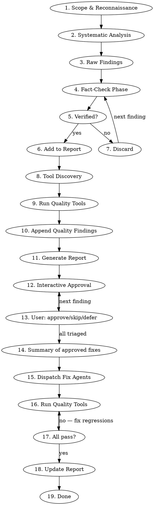

# Security Audit

## Overview

A systematic, evidence-based security audit that scans a codebase for vulnerabilities, **fact-checks every finding against the actual source code**, auto-discovers and runs all available quality tools, and produces an actionable report. The user triages each finding interactively before any fixes are applied.

## Core Principle

**No finding without evidence. No evidence without verification. No fix without user approval.**

Every reported vulnerability must include:
1. The exact file and line where it exists
2. A code snippet proving the vulnerability
3. Verification that no mitigation already exists elsewhere in the codebase
4. A concrete remediation with example code

## Process



## Phase 1: Scope & Reconnaissance

Gather context before auditing:

- **Project type**: web app, API, CLI, library, mobile app
- **Tech stack**: languages, frameworks, dependencies
- **Trust boundaries**: where user input enters, where secrets live, what's exposed
- **Existing security measures**: CSP, auth middleware, input validation, encryption
- **CLAUDE.md / security docs**: check for documented security decisions (accepted tradeoffs, known mitigations)

**CRITICAL:** Read any CLAUDE.md or security documentation FIRST. Projects often document intentional security tradeoffs. Flagging these as vulnerabilities is a false positive.

## Phase 2: Systematic Analysis

Audit against these categories (skip categories that don't apply to the stack):

| Category | What to Look For |
|----------|-----------------|
| **Injection** | SQL injection, command injection, XSS, template injection, path traversal |
| **Authentication** | Weak password policies, missing MFA, session fixation, token leakage |
| **Authorization** | Missing access controls, IDOR, privilege escalation, broken RBAC |
| **Cryptography** | Weak algorithms, hardcoded keys, improper random, missing encryption |
| **Data Exposure** | Secrets in code, verbose errors, sensitive data in logs, PII leakage |
| **Configuration** | Debug mode in prod, permissive CORS, missing security headers, default creds |
| **Dependencies** | Known CVEs, outdated packages, typosquatting risk |
| **Input Validation** | Missing sanitization, type confusion, buffer issues, ReDoS |
| **Error Handling** | Stack traces exposed, fail-open logic, unhandled exceptions |
| **Business Logic** | Race conditions, rate limiting gaps, replay attacks, TOCTOU |
| **Supply Chain** | Lockfile integrity, postinstall scripts, compromised transitive deps |
| **Secrets Management** | Env vars in code, .env committed, API keys in frontend bundles |

### How to Search

For each category, use targeted searches:

```
# Injection vectors
Grep for: eval(, exec(, raw SQL, dangerouslySetInnerHTML, innerHTML, shell_exec
Grep for: user input flowing into commands without sanitization

# Auth issues
Grep for: JWT without expiry, missing token validation, session handling
Check: password reset flows, token refresh logic

# Crypto weaknesses
Grep for: MD5, SHA1 (for security use), Math.random (for security), ECB mode
Check: key derivation, nonce reuse, encryption implementations

# Data exposure
Grep for: console.log with sensitive data, error messages with stack traces
Check: .gitignore coverage, environment variable handling

# Config issues
Grep for: CORS *, debug: true, NODE_ENV checks missing
Check: security headers (CSP, HSTS, X-Frame-Options)
```

## Phase 3: Fact-Check Phase

**This is the most important phase.** For EVERY raw finding:

### Verification Checklist

1. **Does the code actually exist?** Read the file. Confirm the line is real and current.
2. **Is there a mitigation elsewhere?** Search for:
   - Input validation/sanitization before the vulnerable point
   - Middleware that intercepts the request earlier
   - Framework-level protections (e.g., ORM parameterization, auto-escaping)
   - CSP headers blocking the attack vector
   - Rate limiting preventing exploitation
3. **Is it reachable?** Trace the data flow. Can user input actually reach this code path?
4. **Is it an accepted tradeoff?** Check CLAUDE.md, security docs, code comments for intentional decisions.
5. **Is the severity accurate?** Consider:
   - What's the actual impact if exploited?
   - What preconditions are needed?
   - Is it internet-facing or internal only?

### Discard When

- The "vulnerability" is mitigated by another layer (defense in depth working as intended)
- The code is unreachable from user input
- The project documents it as an accepted tradeoff with stated rationale
- The framework already handles it (e.g., parameterized queries in an ORM)
- It requires preconditions that don't exist in this architecture

### Severity Classification

| Level | Criteria |
|-------|----------|
| **CRITICAL** | Remote exploitation without auth, data breach, RCE |
| **HIGH** | Auth bypass, privilege escalation, sensitive data exposure with exploit path |
| **MEDIUM** | Requires auth + specific conditions, limited data exposure, DoS vectors |
| **LOW** | Information disclosure (non-sensitive), missing best practice with no clear exploit |
| **INFO** | Hardening recommendations, defense-in-depth suggestions |

## Phase 4: Report Generation

Write the report to `~/.claude/security-audit/<project>/report.md`, where `<project>` is the
basename of the repository root. Create the directory if needed. Structure:

```markdown
# Security Audit Report

**Date:** YYYY-MM-DD
**Scope:** [what was audited]
**Auditor:** Claude Code

## Executive Summary

- X findings total: N critical, N high, N medium, N low, N info
- Key risk areas: [brief]
- Overall posture: [assessment]

## Quality Tools Discovered

| Tool | Command | Source |
|------|---------|--------|
| PHPStan | `composer run analyse` | composer.json |
| Pint | `composer run check-style` | composer.json |
| ESLint | `npm run lint` | package.json |
| ... | ... | ... |

## Findings

### [SEVERITY] Finding Title

**Status:** OPEN | [RESOLVED] YYYY-MM-DD | [SKIPPED] | [DEFERRED]
**Location:** `file/path.ts:123`
**Category:** [from table above]
**Confidence:** High | Medium | Low
**CVSS (if applicable):** X.X

**Description:**
What the vulnerability is and why it matters.

**Evidence:**
```[language]
// Actual code from the codebase showing the issue
```

**Attack Scenario:**
Step-by-step how this could be exploited.

**Remediation:**
```[language]
// Concrete fix with example code
```

**Verification:**
How to confirm the fix works.

---

## Dismissed Findings (False Positives)

| Potential Issue | Why Dismissed | Evidence |
|----------------|--------------|----------|
| encKey in localStorage | CSP mitigates XSS vector; documented tradeoff | CLAUDE.md, CSP middleware |
| ... | ... | ... |

## Recommendations

Prioritized list of actions, grouped by effort:

### Quick Wins (< 1 hour)
- ...

### Medium Effort (1 day)
- ...

### Larger Initiatives (1+ week)
- ...

## Summary Table

| # | Severity | Location | Category | Status |
|---|----------|----------|----------|--------|
| 1 | CRITICAL | `src/...` | Injection | OPEN |
| 2 | HIGH | `src/...` | Authorization | OPEN |
| ... | ... | ... | ... | ... |
```

## Phase 5: Tool Discovery

Auto-detect available quality tools from project config files. Run them as part of the audit, and
run them again as the gate after every fix, using the project's own commands, never a hardcoded guess at
what this stack uses.

### Discovery Targets

| Config File | What to Extract |
|-------------|----------------|
| `package.json` | `scripts` object entries (lint, format, test, typecheck, analyse, etc.) |
| `composer.json` | `scripts` object entries (test, check-style, analyse, etc.) |
| `Makefile` / `Justfile` | Target names |
| `pyproject.toml` | Tool configs (ruff, mypy, pytest, black) |
| `Cargo.toml` | clippy, test |
| CI config (`.github/workflows/*.yml`, `bitbucket-pipelines.yml`) | Commands from CI steps |

### Behavior

1. Scan for config files in the project root
2. Extract available tool commands
3. List all discovered tools in the report under the "Quality Tools Discovered" section
4. Run each tool in check/dry-run mode (not fix mode)
5. Append tool output issues as findings with category `CODE_QUALITY` and severity:
   - Test failures → HIGH
   - Type errors (PHPStan, tsc, mypy) → MEDIUM
   - Style/lint issues (Pint, ESLint, ruff) → LOW
6. These quality findings go through the same approval as every other finding

**Graceful degradation:** If no config files are found for a given ecosystem, skip it. No hardcoded
assumptions about what tools should exist.
## Phase 6: Interactive Approval

**Do NOT modify any code before this phase.** Present findings to the user one by one for approval.

### Flow

1. Show a summary table first: "X critical, Y high, Z medium, W low, V info" so the user has the full picture
2. Walk through findings starting from highest severity
3. For each finding, present:
   - Severity and title
   - Location and evidence snippet
   - Proposed remediation
4. User responds with one of:
   - **approve**: queued for remediation
   - **skip**: marked as `[SKIPPED]` in report (user accepts the risk)
   - **defer**: marked as `[DEFERRED]` in report (will address later)
   - **edit**: user wants to adjust the proposed remediation before approving
5. User can shortcut at any point: "approve all critical and high", "skip the rest", etc.
6. After all findings are triaged, show a summary of what will be fixed before proceeding

### Approval Rules

- Present **one finding at a time**, and do not batch without user permission
- Always start with the highest severity
- **Wait for a response** before showing the next finding
- If the user says "approve all critical and high", apply that and continue through the lower
  severities
- If the user says "skip the rest", mark all remaining as `[SKIPPED]`
- If the user says "just show me the report and I'll decide later", stop after Phase 4. Do not
  walk the findings and do not fix anything
- **Never proceed to implementation without explicit approval**

## Phase 7: Fix & Verify

Only fix what the user approved in triage.

### Fix Agents

Dispatch fix agents, one per independent finding or logical group of related findings. Each agent receives:
- The exact file(s) and line(s) to change
- The evidence snippet
- The concrete remediation code from the report

**Agent grouping rules:**
- Group findings that touch the same function/block into one agent (avoids edit conflicts)
- Keep CRITICAL/HIGH fixes in their own agents, never bundled with LOW/INFO
- INFO findings (config validation, startup checks) can be bundled into a single agent

**Each fix agent must:**
1. Read the target file(s) before editing
2. Apply exactly the remediation code from the report (no improvising)
3. Verify the edit looks correct after applying

**Example agent prompt structure:**
```
Fix the following security finding in [file]:

Finding: [title from report]
Location: [file:line]
Evidence: [code snippet]
Fix: [remediation code from report]

Read the file first, apply the fix, confirm the change looks correct.
Do NOT modify anything else in the file.
```

### Quality Verification

After each fix:
1. Run ALL discovered quality tools from Phase 5
2. If any tool fails, fix the regression before moving to the next finding
3. Do NOT suppress warnings or skip tests. Fix the root cause

### Report Update

After all approved fixes are applied and verified, update the report in-place:

- Fixed findings: status changed to `[RESOLVED] YYYY-MM-DD`
- Skipped findings: status changed to `[SKIPPED]`
- Deferred findings: status changed to `[DEFERRED]`
- Any new findings discovered during remediation: appended as LOW/INFO
- Quality tool results updated to reflect current state

## Output

- Write the full report to `~/.claude/security-audit/<project>/report.md` (outside the repository;
  create the directory if needed). If the user names a different path, honor it.
- Print the summary table to the terminal.
- Do NOT commit the report. Tell the user where it was written and that it is uncommitted, so a
  later run can diff against it.
- Never output the full report inline. Always write to file first.
- The report is updated in-place as findings are resolved, skipped, or deferred.

## Red Flags: You're Doing It Wrong

- Reporting a finding without reading the actual code at that location
- Not searching for mitigations before reporting
- Flagging documented security tradeoffs as vulnerabilities
- Copy-pasting generic OWASP descriptions without codebase-specific evidence
- Reporting framework-level protections as missing when the framework handles them
- Severity inflation (calling everything "critical")
- No remediation code, just saying "fix it"
- **Auto-fixing without user approval**
- **Skipping tool discovery and running hardcoded tool commands**

## Common Mistakes

| Mistake | Fix |
|---------|-----|
| Flagging ORM queries as SQL injection | Check if the ORM parameterizes, which it almost always does |
| Reporting "secrets in .env" when .env is gitignored | .env is for local dev; check if it's actually committed |
| Missing that CSP blocks XSS vectors | Always check CSP headers before reporting XSS |
| Flagging eval() in build tools | Build-time code isn't attack surface |
| Reporting missing rate limiting when it exists as middleware | Search for rate-limit middleware before reporting |
| Calling localStorage insecure without XSS vector | No XSS = no localStorage exploit. Find the XSS first. |

## Parallel Execution Strategy

For large codebases, dispatch parallel subagents per category:

1. **Auth & Session agent**: authentication, authorization, session management
2. **Injection agent**: all injection types (SQL, XSS, command, path)
3. **Crypto & Secrets agent**: cryptography, key management, secrets exposure
4. **Config & Deps agent**: configuration, headers, dependencies, supply chain
5. **Business Logic agent**: race conditions, rate limiting, logic flaws

Each agent returns raw findings. The main agent then fact-checks ALL findings before report generation.
